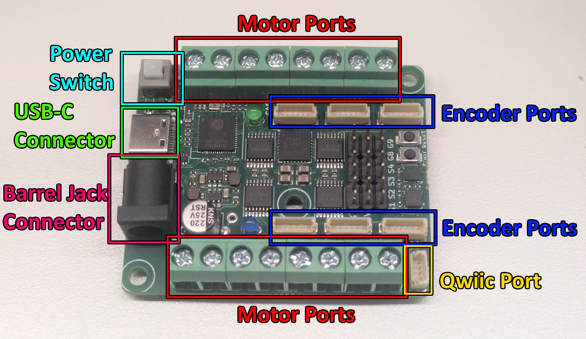
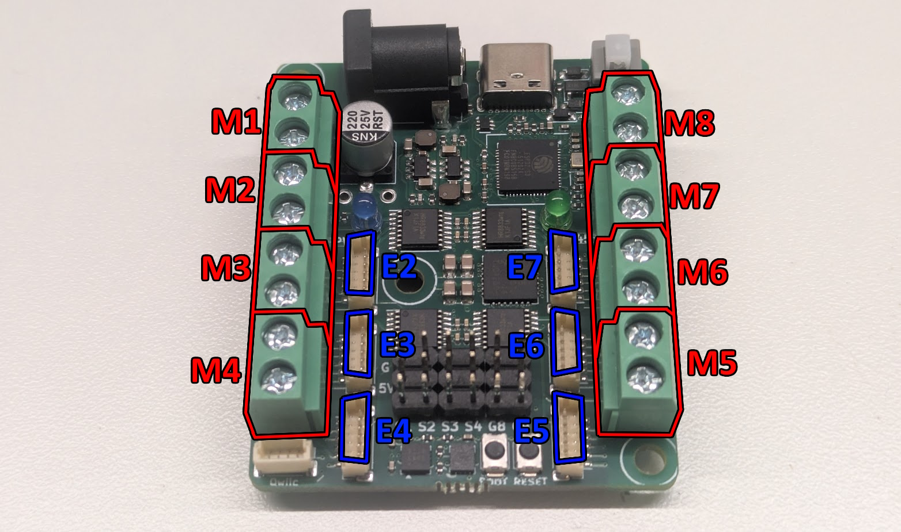
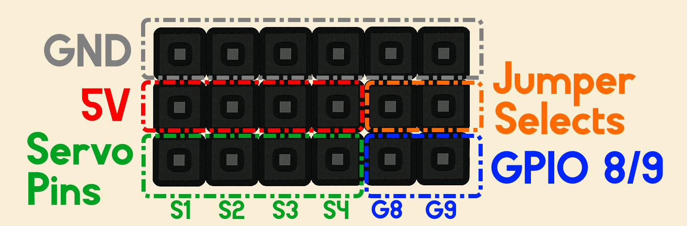
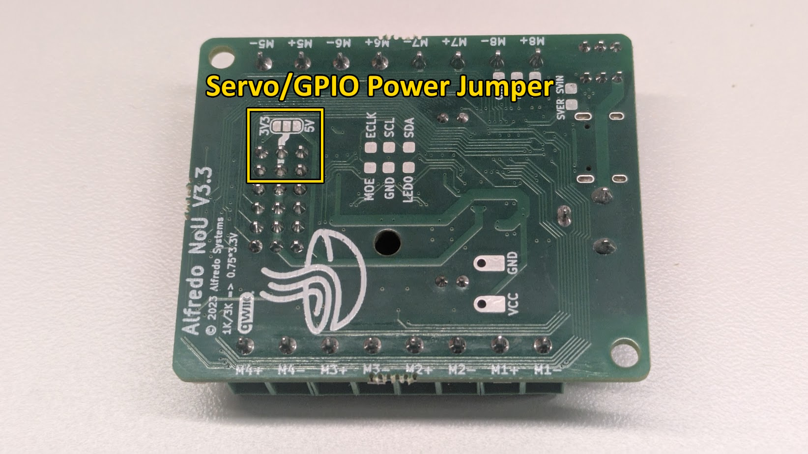
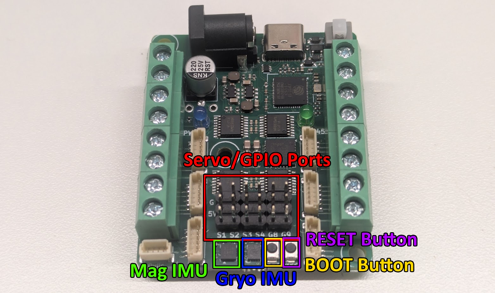
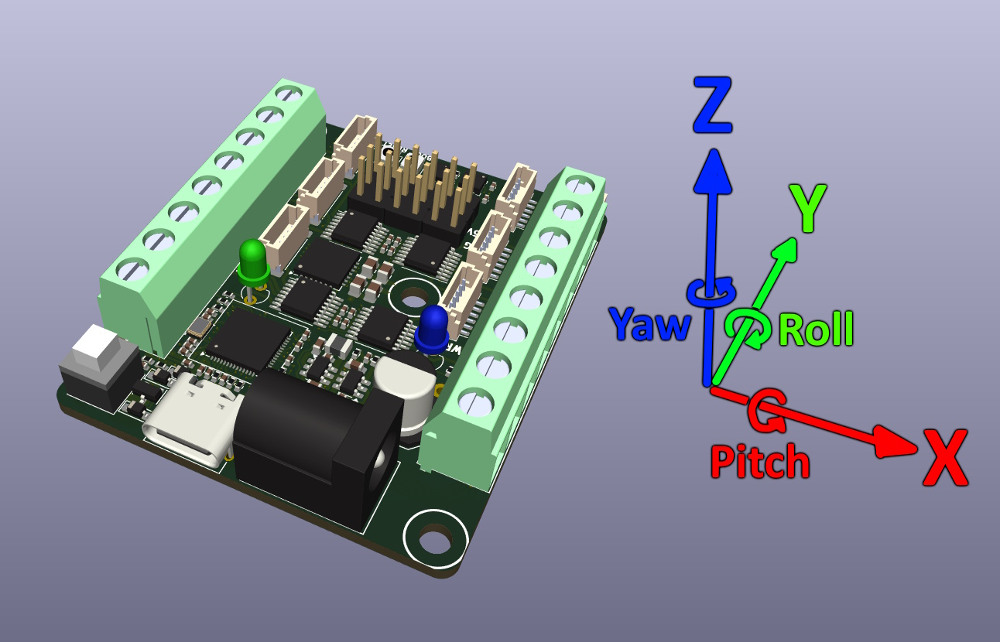

Hardware Documentation
======================

Overview
---------------------
`The NoU3 <https://www.alfredosys.com/products/alfredo-nou3/>`_ is a versatile all-in-one robot control PCB. With an ESP32-S3 as the brain, it features:

* Eight DC motor ports
* Six encoder ports
* Built-in accelerometer, gyroscope, and magnetometer
* USB-C for reliable code upload
* Four easy-to-use servo ports (which can be increased to a max of six)
* Qwiic compatible!
* Rated for up to 11.8V through the 5.5mm DC barrel jack.

Motor Control
-------------
The NoU3 can control up to eight DC motors. Each DC motor has two wires and spins when a voltage difference is applied across them. This requires two terminals, which together make up a motor port.

With 8 ports total, the NoU3 provides 16 total terminals. Each motor port can supply up to 11.8V in either direction and can deliver 1A of continuous current.

Each motor port has a number, M1-M8.

Additionally, the NoU3 has 6 encoder ports, labeled E2-E7. The encoder ports are an alternative terminal for controlling motors, not extra motor ports! For example, if you apply a voltage to a motor plugged into E4, then a motor plugged into M4 will receive the same voltage.

The benefit of encoder ports is that when used with compatible motors, the NoU3 will be able to know the angle those motors rotate to! There are three known compatible motors:

* `Alfredo Systems N20 motor with encoder <https://www.alfredosys.com/products/n20-motor-with-encoder/>`_
* `SparkFun TT motor with encoder <https://www.sparkfun.com/hobby-motor-with-encoder-plastic-gear-pair-red.html>`_
* `SparkFun N20 motor with encoder <https://www.sparkfun.com/n20-motor-with-encoder-and-cable-pair.html>`_

Each encoder port uses the following pinout of a 6-pin JST-SH connector:

* pin 1: M+
* pin 2: M-
* pin 3: 3.3V
* pin 4: Encoder Pin A
* pin 5: Encoder Pin B
* pin 6: GND

Servos and GPIO
---------------
The NoU3 has four servo headers designed for 9g and 50g hobby servos. The Servo Pins provide signals from the ESP32-S3.

S1, S2, S3, and S4 are tied to GPIO pins 4, 5, 6, and 7 respectively. Similarly, G8 and G9 are tied to GPIO pins 8 and 9. By default, G8 and G9 cannot be used to drive a fifth or sixth servo because no voltage is supplied to the "Jumper Select" pins.

Intermediate users can use solder to bridge the gap between either 3.3V or 5V to apply voltage to those two pins (5V for servos). DO NOT bridge 3.3V to 5V or you may destroy your NoU3.

IMUs
----

The NoU3 has two Inertial Measurement Units (IMUs), that together can measure 9 Degrees of Freedom (DoFs). The MMC5983MA chip (Mag IMU) can measure the ambient magnetic field in X, Y, and Z directions. The LSM6DSOX chip (Gyro IMU) can measure the angular rotation of the NoU3 in the pitch, roll, and yaw directions, as well as the linear acceleration felt by the NoU3 in the X, Y, and Z directions.

If you are using the NoU3 library, then the library will automatically use angular rotation measurements to calculate changes in angle in the pitch, roll, and yaw directions. See the **PestoLink_HolonomicBot.ino** example for more information.

The NoU3 uses the following convention for orientation:

Buttons
-------

The two buttons can be used to interact with the ESP32-S3. The RESET button will restart whatever program is uploaded to it, as if the bot had just been turned on. The BOOT button is used to put the ESP32-S3 in BOOT Mode. See the `troubleshooting section <robot_programming_tutorial_Pesto_Link.html#troubleshooting>`_ of the programming guide for information about BOOT mode.

Qwiic Connector
----------------

Qwiic is a standardized I2C connector system created by SparkFun Electronics to make it easy to connect sensors, microcontrollers, and other I2C devices without soldering or wiring confusion. Adafruit STEMMA QT devices are also compatible. The NoU3 Uses GPIO 33 for SDA and GPIO 34 for SCL. If you are using the NoU3 library, then you dont even need to worry about I2C pins, by default the **Wire** object is set and configured with the correct pins for Qwiic.

Power Management
----------------
Power levels on the NoU3 are managed by several switch mode regulators, bulk capacitors, and decoupling capacitors. The board has two SY8113B DC-DC step down regulators that supply 3.3V and 5V respectively. For bulk capacatance, the NoU3 has a 220uF electrolytic capacitor.
